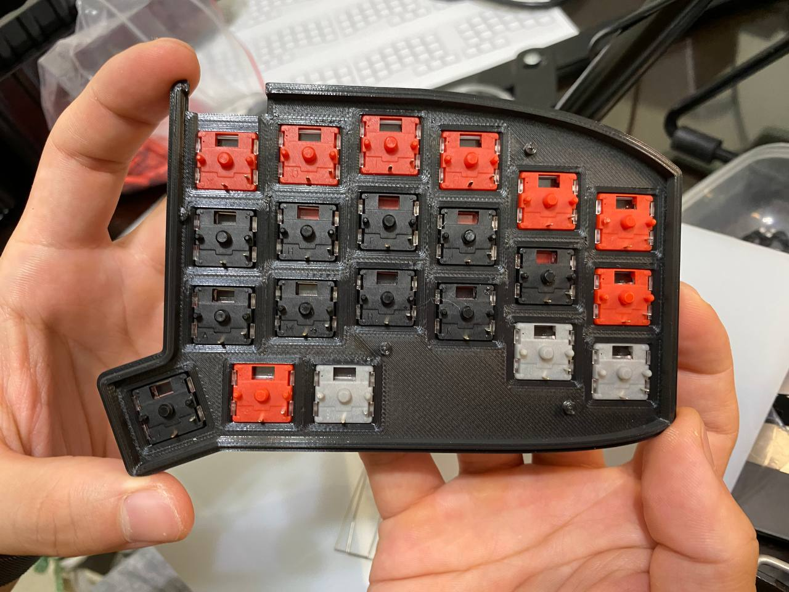

#  務實42組裝心得

## 問題
1. 首先找不到上下左右鍵的問題
初期因為不熟悉鍵盤的操作方式，打字速度會大幅度的降低。再加上為了配合漢語拼音容易卡在一個段落，腦袋明明已經想好內容但手沒辦法如實的打出來。
（所以可以透過這篇文章好好的練習）
以下附上鍵盤配置的圖片，盡可能地保留原版，並且把自己常用的快捷鍵不融入到layer中
2. 如何練習 
 [漢語拼音](http://www.daziba.cn/pylx/)

## 過程
### 行前說明
行前討論本來預估一兩個小時就可以完成，但是當天早上James讓我練習了兩個小時，出乎我的意料之外，過程中，James大大對於每一個步驟都會細心地講解，對改造自己鍵盤有興趣的夥伴可以從中學到滿滿的乾貨。

### 焊接
當天James準備了各種器材，讓我這個焊接小白也可以輕鬆上手。除了行前練習之外，過程中遇到任何的問題都可以馬上發問，增添了不少安全感，畢竟對於第一次接觸的人來說，最難跨出的第一步就是害怕。（我可以保證連我都可以了，James根據我的feed back所優化的新教學模式絕對可以讓過程無痛學習。）

### 組樂高的快樂過程
當一切準備就緒，James大大拿出令人眼睛為之一亮的玩具箱，裡面有三種軸體，可以一字排開在桌面上試打，探索不同的排列組合，找到自己最舒適的硬體位置（軟體等等才會調整XD）
本來對於各種挑選猶豫不決的我（軸體、鍵帽、顏色族繁不及備載。）通過嘗試各種組合，也可以滿滿的組合出心中的理想鍵盤，不過即使是這樣，我還是會想要再多買幾種軸，畢竟James大大都貼心的提供熱插拔的規格。

### 關於Debug
組裝將近九成的時候就會進入debug環節，這個部份也是工作坊最大的優點，因爲自己一個素人組裝到這個階段，應該已經精疲力竭，如果遇到bug應該會崩潰==。
剛好我遇到某一顆鍵位按下去沒有反應，一開始以為是我的電路板上面安裝鍵的零件沒安裝好，結果是剛好遇到一顆壞掉的軸。
在這種時候有一個有經驗的人在旁邊可以馬上指導，對於製作體驗可以提昇不少。

## 心得
### 鍵盤使用心得
首先對於背部疼痛改善的這一點，可以在約莫第三天有明顯的改善，但是對於正在熟悉鍵位的人，會因為努力的打字讓手指比平常更緊繃（加上還要熟悉漢語拼音QQ）。
鍵盤的敲擊感很棒，不過50g的軸我自己的某幾顆會有彈簧音，但是瑕不掩瑜，畢竟這個小小的問題可以再買軸就可以解決，說到這裡可以回扣到爲什麼工作坊會更加吸引我。因為幾乎所有零件都是自己焊接，加上James也有好好的講解原理與方法，所以如果有問題也可以自己解決，讓鍵盤就算到了使用者手上也可以繼續迭代，而在使用者手上的迭代往往更加重要。
### 製作過程心得
從開始有腕隧道症候群開始，就開始上網搜尋人體工學鍵盤，本來只有找到logi的版本，雖然不錯打，但自己又不想放棄機械式鍵盤。
國外其他來源的鍵盤不僅價格貴，一堆零件的專有名詞也讓初學者難以窺探其中的樂趣。
無意間看到ptt某一則留言提到可以google務實鍵盤，抱著嘗試的心態，加入了telegram的群組，裡面的senior們都會細心的介紹，甚至還給了我這麼有趣的機會，讓人不得不相信吸引力法則的存在。
如果你想嘗試分離式鍵盤，或是想要體會跟一群發燒友交流的快樂，誠摯的推薦這個深不見底的坑。